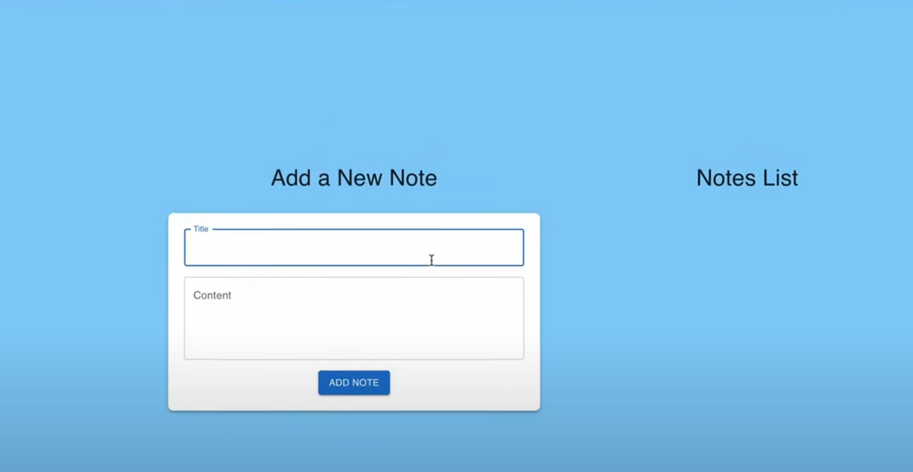
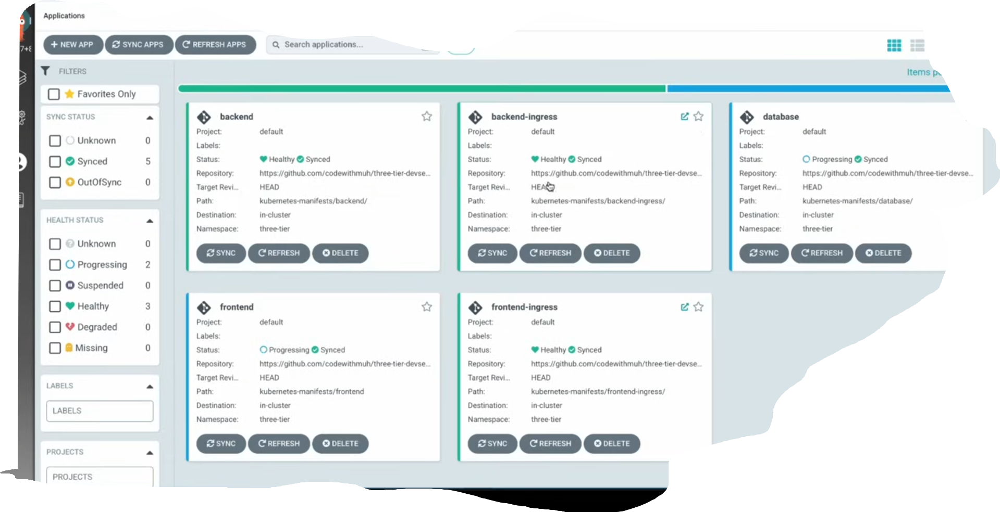

# Three-Tier DevSecOps Web Application on AWS EKS

This Repo is the blueprint for leveraging AWS services like ECR, S3, DynamoDB, and EC2, with Terraform as the backbone for Infrastructure as Code (IaC). From setting up an IAM user with proper permissions to configuring pipelines for building, scanning, and deploying frontend and backend applications, you'll discover how to create a production-grade system designed for scalability and security.

A complete DevSecOps implementation of a three-tier web application deployed on AWS EKS using Infrastructure as Code, CI/CD pipelines, security scanning, and GitOps practices.


## 🏗️ Architecture Overview

This project demonstrates a production-grade three-tier application deployment featuring:
- **Frontend**: React-based web interface
- **Backend**: RESTful API services
- **Database**: PostgreSQL with persistent storage
- **Infrastructure**: AWS EKS, ECR, S3, DynamoDB
- **CI/CD**: Jenkins pipelines with security scanning
- **GitOps**: ArgoCD for automated deployments
- **Monitoring**: Prometheus & Grafana stack

## 🚀 Project Steps

### 1. IAM User Setup
Create an IAM user with necessary permissions for EKS, S3, DynamoDB, ECR, and EC2.

1. Navigate to AWS Console → IAM → Users
2. Click "Create User"
3. Provide a username
4. Attach AdministrativeAccess policy (for testing; use limited policies in production)
5. Create Access Key under Security Credentials
6. Select "Command Line Interface (CLI)"
7. Download the CSV file containing access key and secret key

### 2. Terraform & AWS CLI Installation

Install Terraform from the [official website](https://developer.hashicorp.com/terraform/tutorials/aws-get-started/install-cli).

Install AWS CLI from the [AWS installation page](https://docs.aws.amazon.com/cli/latest/userguide/getting-started-install.html).

Verify installations:
```bash
terraform --version
aws --version
```

Configure AWS CLI:
```bash
aws configure
```
Enter your Access Key ID, Secret Access Key, default region, and output format.

### 3. S3 Bucket and DynamoDB Table

Create S3 bucket for Terraform state files:
- Bucket name: Choose any unique name

Create DynamoDB table for state locking:
- Table name: `lock-files`
- Partition key: `LockID`

### 4. Jenkins EC2 Server Setup with Terraform

Clone the repository:
```bash
git clone https://github.com/codewithmuh/three-tier-devsecops-project.git
cd three-tier-devsecops-project/jenkins-server-terraform
```

Update `backend.tf` with your S3 bucket and DynamoDB table names.

Create SSH key pair:
```bash
aws ec2 create-key-pair --key-name devsecops-project --query "KeyMaterial" --output text > devsecops-project.pem
```

Deploy Jenkins server:
```bash
terraform init
terraform validate
terraform apply
```

SSH into the server:
```bash
chmod 400 "devsecops-project.pem"
ssh -i "devsecops-project.pem" ubuntu@<EC2-PUBLIC-IP>
```

Configure AWS CLI on Jenkins server:
```bash
aws configure
```

### 5. Installing Jenkins Plugins

Access Jenkins at `http://<EC2-IP>:8080`

Retrieve initial admin password:
```bash
sudo cat /var/lib/jenkins/secrets/initialAdminPassword
```

Install the following plugins via Manage Jenkins → Plugins → Available Plugins:
- AWS Credentials
- AWS Steps
- Docker plugins
- Eclipse Temurin installer
- NodeJS
- OWASP Dependency-Check
- SonarQube Scanner

### 6. SonarQube Setup

Access SonarQube at `http://<jenkins-server-public-ip>:9000`

Default credentials: `admin` / `admin`

Configuration steps:
1. Create project for frontend code analysis
2. Create project for backend code analysis
3. Replace project keys in `jenkins-pipeline` folder
4. Create SonarQube token and save it
5. Create webhook: `http://<jenkins-ec2-server-public-ip>:8080/sonarqube-webhook/`

### 7. Amazon ECR Repositories

Create two ECR repositories:
- `frontend`
- `backend`

Login to ECR from Jenkins server using the push commands provided in AWS Console.

### 7a. Add Credentials in Jenkins

Navigate to Manage Jenkins → Credentials and add:
- `aws-key` (AWS credentials)
- `GITHUB` (username & password)
- `github` (secret text - personal access token)
- `sonar-token`
- `ECR_REPO_FRONTEND`
- `ECR_REPO_BACKEND`
- `ACCOUNT_ID` (AWS account ID)

Configure tools in Dashboard → Manage Jenkins → Tools:
- JDK
- SonarQube Scanner
- NodeJS
- OWASP Dependency-Check
- Docker

Configure SonarQube in Dashboard → Manage Jenkins → System:
- Name: `sonar`
- Server URL: `http://<jenkins-server-public-ip>:9000`
- Server authentication token: Select the saved sonar-token

### 8. EKS Cluster Deployment

Create EKS cluster:
```bash
eksctl create cluster --name three-tier-k8s-eks-cluster --region us-west-2 --node-type t2.medium --nodes-min 2 --nodes-max 2
```

Verify nodes:
```bash
kubectl get nodes
```

Configure AWS Load Balancer Controller:

Download IAM policy:
```bash
curl -O https://raw.githubusercontent.com/kubernetes-sigs/aws-load-balancer-controller/v2.5.4/docs/install/iam_policy.json
```

Create IAM policy:
```bash
aws iam create-policy --policy-name AWSLoadBalancerControllerIAMPolicy --policy-document file://iam_policy.json
```

Create OIDC provider:
```bash
eksctl utils associate-iam-oidc-provider --region=us-west-2 --cluster=three-tier-k8s-eks-cluster --approve
```

Create service account (replace `<your-account-id>`):
```bash
eksctl create iamserviceaccount --cluster=three-tier-k8s-eks-cluster --namespace=kube-system --name=aws-load-balancer-controller --role-name AmazonEKSLoadBalancerControllerRole --attach-policy-arn=arn:aws:iam::<your-account-id>:policy/AWSLoadBalancerControllerIAMPolicy --approve --region=us-west-2
```

Deploy AWS Load Balancer Controller:
```bash
helm repo add eks https://aws.github.io/eks-charts
helm repo update eks
helm install aws-load-balancer-controller eks/aws-load-balancer-controller -n kube-system --set clusterName=three-tier-k8s-eks-cluster --set serviceAccount.create=false --set serviceAccount.name=aws-load-balancer-controller
```

Verify deployment:
```bash
kubectl get deployment -n kube-system aws-load-balancer-controller
```

### 9. Prometheus and Grafana Installation

Add Helm repositories:
```bash
helm repo add stable https://charts.helm.sh/stable
helm repo add prometheus-community https://prometheus-community.github.io/helm-charts
```

Create monitoring namespace:
```bash
kubectl create namespace monitoring
```

Install kube-prometheus-stack:
```bash
helm install stable prometheus-community/kube-prometheus-stack -n monitoring
```

Verify installation:
```bash
kubectl get pods -n monitoring
kubectl get svc -n monitoring
```

Expose Prometheus via LoadBalancer:
```bash
kubectl edit svc stable-kube-prometheus-sta-prometheus -n monitoring
```
Change `type: ClusterIP` to `type: LoadBalancer`

Expose Grafana via LoadBalancer:
```bash
kubectl edit svc stable-grafana -n monitoring
```
Change `type: ClusterIP` to `type: LoadBalancer`

**Grafana Access:**
- Username: `admin`
- Password: `prom-operator`

### 10. Jenkins Pipelines

Set up CI/CD pipelines for:
- Frontend application
- Backend application

Pipelines include stages for:
- Code checkout
- Build
- Security scanning (SonarQube, OWASP, Trivy)
- Docker image build and push to ECR
- Kubernetes manifest updates

### 11. ArgoCD Installation & Application Deployment

Create application namespace:
```bash
kubectl create namespace three-tier
```

Create ECR registry secret:
```bash
kubectl create secret generic ecr-registry-secret \
  --from-file=.dockerconfigjson=${HOME}/.docker/config.json \
  --type=kubernetes.io/dockerconfigjson --namespace three-tier
```

Verify secret:
```bash
kubectl get secrets -n three-tier
```

Install ArgoCD:
```bash
kubectl create namespace argocd
kubectl apply -n argocd -f https://raw.githubusercontent.com/argoproj/argo-cd/v2.4.7/manifests/install.yaml
```

Verify ArgoCD pods:
```bash
kubectl get pods -n argocd
```

Expose ArgoCD server:
```bash
kubectl patch svc argocd-server -n argocd -p '{"spec": {"type": "LoadBalancer"}}'
```

Install jq for password retrieval:
```bash
sudo apt install jq -y
```

Get ArgoCD credentials:
```bash
export ARGOCD_SERVER=$(kubectl get svc argocd-server -n argocd -o json | jq -r '.status.loadBalancer.ingress[0].hostname') && export ARGO_PWD=$(kubectl -n argocd get secret argocd-initial-admin-secret -o jsonpath="{.data.password}" | base64 -d) && echo "ARGOCD_SERVER: $ARGOCD_SERVER" && echo "ARGO_PWD: $ARGO_PWD"
```

Configure ArgoCD applications:
1. Database
2. Backend
3. Frontend
4. Frontend Ingress
5. Backend Ingress



### 12. DNS Configuration

Configure DNS to point to the EKS load balancer using Cloudflare or your preferred DNS provider to make applications accessible via custom domains.

### 13. Data Persistence

Persistent Volumes (PV) and Persistent Volume Claims (PVC) are configured for the database pods to ensure data persistence across pod restarts and deletions.

## 🛠️ Tech Stack

**Infrastructure:**
- AWS EKS, EC2, ECR, S3, DynamoDB
- Terraform (Infrastructure as Code)

**CI/CD:**
- Jenkins
- ArgoCD (GitOps)

**Security:**
- SonarQube (Code Quality)
- Trivy (Container Scanning)
- OWASP Dependency-Check

**Monitoring:**
- Prometheus
- Grafana

**Container Orchestration:**
- Kubernetes
- Docker
- Helm

## 🧹 Cleanup

To avoid AWS costs after testing, follow these steps:

1. Delete EKS cluster:
```bash
eksctl delete cluster --name three-tier-k8s-eks-cluster --region us-west-2 --wait --timeout 30m
```

**Note:** If you encounter load balancer errors, manually delete frontend and backend load balancers first.

2. Destroy Terraform infrastructure:
```bash
cd jenkins-server-terraform
terraform destroy
```

3. Delete remaining AWS resources:
   - S3 bucket
   - DynamoDB table
   - IAM user
   - GitHub personal access token

## 📝 Notes

- For production environments, replace AdministrativeAccess with granular IAM policies
- Implement proper secrets management (AWS Secrets Manager, Vault)
- Configure backup strategies for persistent data
- Set up proper monitoring alerts and thresholds
- Implement cost monitoring and budget alerts

## 📚 Resources

- [Terraform Documentation](https://developer.hashicorp.com/terraform)
- [AWS EKS Documentation](https://docs.aws.amazon.com/eks/)
- [ArgoCD Documentation](https://argo-cd.readthedocs.io/)
- [Prometheus Documentation](https://prometheus.io/docs/)

## 🤝 Contributing

Contributions are welcome! Please feel free to submit a Pull Request.

## 📄 License

This project is licensed under the MIT License.
